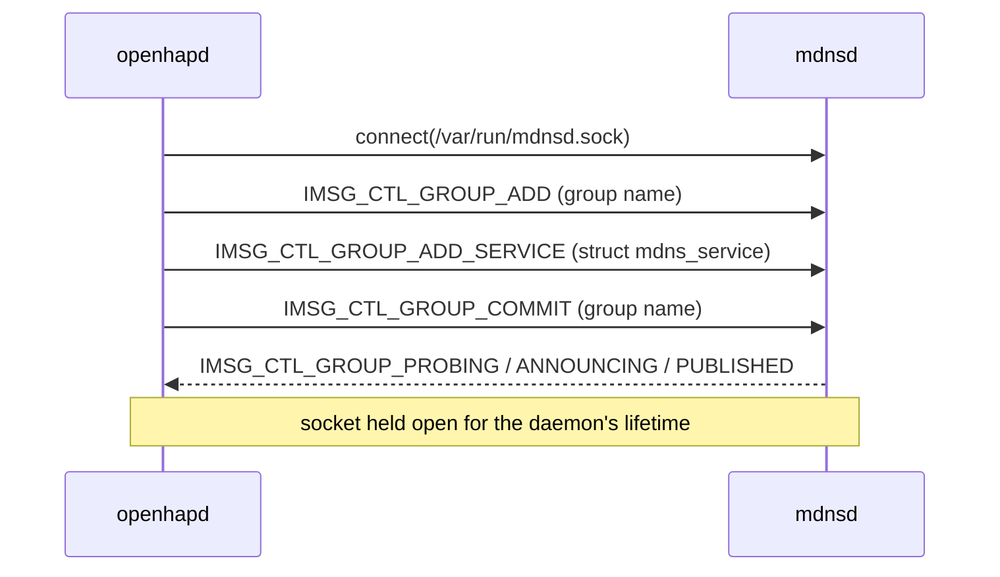

# pledge(2) and unveil(2) for openhapd — Design

## Problem

`README.md` says OpenHAP is "Native with pledge(2)/unveil(2) support",
`CLAUDE.md` names them as the production platform's defining property, and
`web/index.body.html` links both man pages. None of it is true: there is no
`pledge` or `unveil` call anywhere in `bin/` or `lib/`, no `FuguLib` module for
either, and no test. `TODO.md:10-20` records the gap accurately.

`bin/openhapd` daemonizes, drops to `_openhap`, then enters `HAP::run`. A
compromised TLV or HTTP parser therefore has the full syscall surface and the
whole filesystem, limited only by uid.

One structural obstacle stands in the way. `OpenHAP::MDNS` advertises the
service by spawning `mdnsctl publish` as a long-lived child (`MDNS.pm:117`,
killed at `MDNS.pm:152`), and any pledge covering that needs `proc exec` — most
of what pledge exists to take away. That child exists only because `mdnsctl`
holds the advertisement open as long as its control socket is, and openhapd can
hold it.

## Goals

1. `openhapd` runs its event loop under a single `pledge(2)` promise set with no
   `proc`, `exec`, or `prot_exec`, and under a locked `unveil(2)` view.
2. The pledge/unveil API is a `FuguLib` platform abstraction: real on OpenBSD, a
   no-op on Linux and Darwin, so `make check` behaves identically everywhere.
3. mDNS speaks to `mdnsd(8)` over `/var/run/mdnsd.sock` directly: no child
   process, no `mdnsctl.log`, no kill-on-shutdown.
4. That protocol is documented in `spec/` and covered by conformance tests
   citing it, like every other protocol in the tree.
5. Failures fail closed: an unappliable restriction on OpenBSD is fatal.
6. The restrictions are proven by tests that fail if they are silently absent.
7. **No new startup failure.** Every configuration that starts today still
   starts. An unveil inventory lists what the daemon may reach; a path that is
   legitimately absent must not become a refusal to boot.

## Non-goals

- **Two-stage or per-phase pledges.** One promise set, applied once; tightening
  after pairing is a later refinement.
- **Privilege separation** into helper processes (`TODO.md:489`), and **pledging
  `hapctl`** — both follow-ups, the latter cheap once `FuguLib::Sandbox` exists.
- **Weakening the documentation.** `README.md`, `CLAUDE.md` and `web/` keep
  their claims; phase 4 makes them true rather than the docs shrinking to fit.
- **Fixing `pv=1`.** `HAP.pm:1087` sends protocol version `1`, not `1.1`,
  because mdnsd splits TXT strings on `.` with no escape. A native client hands
  mdnsd the same payload, so the constraint is unchanged.
- **Fixing SIGHUP.** `etc/rc.d/openhapd:16-18` reloads by sending SIGHUP, which
  `bin/openhapd:177` registers as a graceful _exit_ — so `rcctl reload` stops
  the daemon today. Pre-existing bug, out of scope; phase 5 records it in
  `TODO.md`. Nothing in this design may justify itself by a reload that does not
  exist.
- **A full mdnsd client.** Browse, resolve and lookup are specified in phase 1
  because they share the framing and the enum, but only publish is implemented.
- Bonjour/Avahi backends; mDNS stays OpenBSD-only, exactly as today.

## Should the mDNS client be a fourth sub-project?

No. The precedent splits on **lifecycle and audience**, not subject matter:
OpenHVF earned a namespace by being a separate _program_ — own entry point,
config format and man page section, development-only, never installed. An mdnsd
client is FuguLib's shape, and so is a pledge wrapper: a shipped library with no
CLI, no config, no user of its own. Precedent also says FuguLib _absorbs_
(`OpenHAP::Log` became `FuguLib::Log`). Revisit when the client grows consumers
outside this repo, or a `bin/` tool.

FuguLib going from six modules to nine is a documentation change too:
`CLAUDE.md:13-14` enumerates the namespace's concerns and
`web/fugulib.body.html:8` states "Six modules". Each phase that changes the fact
updates both in the same change — phase 2 to eight, phase 3 to nine — a module
count is not a hedge: it has a final true value at every phase, and `web.yml`
deploys the site on any `man/**.3p` push. Phase 5 verifies.

## Architecture

Three new `FuguLib` modules — `Sandbox` (pledge/unveil) and `MDNS` (the mdnsd
group protocol) over `Imsg` (framing) — a new hand-authored `spec/MDNS*.md`
family, one deletion, one new call site.

### The mDNS protocol reference

Implementing a wire protocol against another daemon's in-memory struct layout
makes this a protocol reference's job, so phase 1 writes one into `spec/` before
any client code exists: `MDNS.md` (index), `MDNS-Imsg.md` (framing) and
`MDNS-Control.md` (control socket, `imsg_type` enum, publish sequence,
`struct mdns_service` ABI, TXT encoding).

Hand-authored and hand-maintained, per `spec/CLAUDE.md:24` ("These are
hand-maintained documents. Edit them in place"), with every claim citing the
upstream file and line — exactly how `HAP.md` and `MQTT.md` are maintained.
There is no generator skill: the spec-generation and reference-fetching skills
were removed in `2da2b57`, and `spec/` is curated by hand.

That is the right answer to the ABI coupling, this design's principal risk: the
`IMSG_CTL_GROUP_ADD_SERVICE` payload is a raw `struct mdns_service`, binding us
to mdnsd's in-memory layout, padding and all. A spec section recording the
measured offsets plus a byte-exact conformance test citing it turns a hidden
assumption into a checked one. `spec/HAP-mDNS.md` does not absorb this and must
not: it says _what_ HomeKit requires be advertised, while `MDNS-*.md` says _how_
to advertise it on OpenBSD.

### Measure before implementing

Headers give field lists, not offsets, padding, or what a real client puts on
the wire — and for one part of the protocol, reading upstream suggests our
intended sequence may not work at all. Phase 1 measures inside the OpenBSD VM
(task 1.2 has the detail); phase 2 is written against the measurements, not
against this document. Three **gate phase 2's API**: the `imsg_hdr` layout from
the installed header (its field set changed in the 2024 imsg rework, so any
layout written here is a guess); whether same-socket `GROUP_RESET` actually
replaces a TXT record, or silently re-announces the stale one, or crashes mdnsd;
and whether the group name must equal the service instance name. Phase 1 also
captures a byte-exact publish conversation, the `struct mdns_service` offsets,
the daemon's real path set — phase 4's input — and what the platform's tooling
can observe about an applied pledge and unveil (what `kdump` renders for each
call's arguments, whether `ps -o pledge` exists), which phase 5's proof tests
are designed against.

### `FuguLib::Imsg` and `FuguLib::MDNS`

`mdnsctl publish` performs a four-message conversation and then simply stays
alive; mdnsd withdraws the record when the control socket closes.



`FuguLib::Imsg` is the framing layer — a native-endian header (layout from the
installed `imsg.h`) plus payload, and buffered reads yielding whole messages;
pure serialisation, unit-testable with no daemon present. `FuguLib::MDNS` is the
protocol layer: `connect`, `publish_service`, `update_txt`, `withdraw` (close),
`is_published`, and translation of reply and error types into reported outcomes.

`update_txt`'s mechanism is decided by measurement. If same-socket `GROUP_RESET`
does not work it reconnects and republishes — which is what `MDNS.pm:177-185`
does today, and which keeps `unix` in the promise set for a reason that outlives
startup.

**Neither module logs.** FuguLib's convention is that the caller decides:
`Privdrop` dies, `Process` reports through `on_error`/`on_success` callbacks,
and no module under `lib/FuguLib/` references a logger. These two follow
`Process`, so `lib/FuguLib/` never names `$OpenHAP::logger` and `t/fugulib/*.t`
needs no OpenHAP globals.

`OpenHAP::MDNS` and its `.pod` are deleted. `bin/openhapd` and
`HAP::_refresh_mdns` (`HAP.pm:148`) talk to `FuguLib::MDNS`. The HAP-specific
`hap`/`tcp` knowledge and the TXT _formatting_ — `key=value` pairs joined in
sorted order, currently `MDNS.pm:85-87` — move into `OpenHAP::HAP` beside
`get_mdns_txt_records`, which today returns only a bare hashref. `FuguLib::MDNS`
takes `txt` as a formatted string and knows nothing of HomeKit.

### `FuguLib::Sandbox`

One module covering both mechanisms, because they are one decision applied at
one point; a module named `Pledge` that also unveils would misname itself.

- `is_supported()` — true only on OpenBSD. This, not a log line, is how a caller
  or test tells enforcement from emulation.
- `pledge(promises => $string)` — 1 on success, `die` on failure.
- `unveil(paths => [[$path, $perms], ...])` — applies pairs **in order**,
  reporting which failed. An ordered list, not a hash: unveil replaces rather
  than merges a path's permissions, so parent/child order is load-bearing.
  Entries carry a required/optional disposition (see the unveil view).
- `unveil_lock()` — calls `OpenBSD::Unveil::unveil()` with **no arguments**.
  Passing two `undef`s reaches the C layer as `unveil("", "")` and fails with
  `ENOENT`.

On OpenBSD the base-system `OpenBSD::Pledge`/`OpenBSD::Unveil` load at `use`
time and failing to load is fatal — there, their absence means a broken Perl,
not an unsupported system. Off OpenBSD every method returns 1 having done
nothing.

### The promise set

One string, applied after mDNS registration and before `$hap->run()`:

```
stdio rpath wpath cpath fattr flock inet dns unix
```

| promise       | required by                                                      |
| ------------- | ---------------------------------------------------------------- |
| `stdio`       | always                                                           |
| `rpath`       | `/dev/urandom` (`Crypto.pm:35`), `Storage` reads, lazy `require` |
| `wpath cpath` | `Storage` creating and rewriting db files after startup          |
| `fattr`       | `chmod 0600` (`Storage.pm:158`, `:240`)                          |
| `flock`       | `Storage.pm:62,82,139,155`                                       |
| `inet`        | listen socket built in `HAP::run` (`HAP.pm:158`), MQTT reconnect |
| `dns`         | MQTT reconnect resolving `mqtt_host` when it is a name           |
| `unix`        | reconnecting to mdnsd, **if** `update_txt` must republish        |

`wpath cpath` are exercised after the pledge by `Storage`'s `open '>'` calls —
pairings.db on the first pairing (`Storage.pm:131`), `config_number` and
`auth_attempts` (`Storage.pm:236`), the accessory keys on factory reset
(`HAP.pm:1128`) — and Perl's `>` always passes `O_CREAT`, so `cpath` is needed
on every such write, not only on a fresh install. `make_path` (`Storage.pm:14`)
and the daemon log's open both complete before the pledge point: they are
context, not justification, and post-pledge log writes go to the already-open fd
under `stdio`.

`unix` is the one conditional entry. An already-connected socket needs only
`stdio` to read and write — `PLEDGE_UNIX` gates `socket`, `connect` and `bind`,
all of which happen before the pledge — so `unix` is required exactly when
measurement says `update_txt` reconnects. If same-socket replacement works, it
comes out; phase 3 does not carry a promise nothing exercises.

Deliberately absent: `proc exec` (phase 2 removes the only `exec`), `prot_exec`
(below), `getpw` and `id` (`getpwnam` and privdrop precede pledge),
`sendfd recvfd`. Syslog needs none — `Sys::Syslog` in native mode reaches
`sendsyslog(2)`, always permitted.

### Late loading, and why `prot_exec` stays out

`prot_exec` is excluded because **nothing dlopens after startup**. Every XS
dependency is pulled in by a compile-time `use` on the graph reachable from
`bin/openhapd:7` — the five crypto modules at `Crypto.pm:5-10`, `JSON::XS` and
`Digest::SHA` at `HAP.pm:6,8`, and `Math::BigInt try => 'GMP'` at `SRP.pm:9` via
`HAP.pm:13` → `Pairing.pm:5`. `Math::BigInt` resolves its backend inside
`import`, not at first arithmetic, so GMP's shared object is open before
`GetOptions` runs; there is no pairing-time load to preload.

The one `require` not settled at compile time is `Net::MQTT::Simple` at
`MQTT.pm:50` — and it is not deferred by a broker that is down: the require
completes before the connect attempt (`MQTT.pm:57`) inside the same `eval`, and
`bin/openhapd:88` runs `mqtt_connect` unconditionally at startup, so an
installed module is in `%INC` pre-pledge in every scenario. The genuinely late
case is the module being absent at startup and installed while the daemon runs:
the next reconnect's require then succeeds post-pledge. It is **pure Perl**, so
it needs no `prot_exec` — only `rpath` and a reachable library tree, which that
case is the standing reason for. So: unveil the library directories read-only,
and resolve it before the pledge under `eval` so its transitive dependencies
load while loading is unrestricted. It stays optional — the only `cpan` runtime
line in `deps/OpenBSD.txt`, and `bin/openhapd:88-97` deliberately keeps serving
HomeKit without it. Unveiling the library tree read-only is the deliberate
simplicity trade: weaker than proving no module ever loads late, far more robust
than discovering a missed `require` in production.

### The unveil view

Read-only for the config file, `/dev/urandom`, the resolver files and the Perl
library directories; read-write-create for `$db_path`; write for the daemon log;
read-write for `/var/run/mdnsd.sock` if `update_txt` reconnects. Then
`unveil_lock()`, then `pledge`. The inventory is in `plan-4.md`, derived from
measurement rather than from reading code. Two rules it obeys:

- **Per-path disposition.** Each entry is _required_ (absent means a broken
  install: `$db_path`, `/dev/urandom`, the library directories) or _optional_
  (legitimately absent: the config file, the log file, the mdnsd socket, the
  resolver files). Required paths are fatal when missing; optional paths are
  skipped. Without this split goal 7 fails — a missing `/etc/openhapd.conf`, an
  `mdnsd` that is not running, or a first `openhapd -f` on a fresh box would
  each refuse to start where they work today.
- **Library directories are enumerated, not derived from live `@INC`.**
  `bin/openhapd:4-5` prepends `"$RealBin/../lib"`, which on an installed layout
  is `/usr/local/lib` — every third-party library under `/usr/local`, not a Perl
  tree. And `MQTT.pm:42-45` mutates `@INC` inside `mqtt_connect`, so a derived
  set depends on whether the startup connect has run.

Both come after privdrop: unveil only removes reachability, so applying it as
`_openhap` keeps the root-only `chown` loop (`bin/openhapd:118-137`) working.

## Contracts

- On OpenBSD, `openhapd` never reaches `HAP::run` without both restrictions
  applied; failing to apply either is fatal first. Off OpenBSD, behaviour is
  byte-identical to today.
- Every configuration that starts today still starts. A missing optional path
  degrades or is skipped; it never refuses to boot.
- The socket to mdnsd is the advertisement's lifetime. Closing it withdraws the
  service — that is how shutdown unregisters. No signal, no child, no kill.
- A `FuguLib::MDNS` failure stays non-fatal, exactly as `OpenHAP::MDNS` failure
  is today: HAP still serves, discovery is degraded, a warning is logged by the
  caller. `OpenHAP::HAP` must not drive TXT updates onto an unpublished handle —
  today that guard lives at `MDNS.pm:181`, inside the module being deleted.
- `FuguLib` modules do not log. They return outcomes; callers log.
- mDNS advertisement is lost if `mdnsd` restarts and is not re-established until
  `openhapd` restarts. Parity with today, so it is documented, not fixed.
- The `struct mdns_service` and `imsg_hdr` layouts live in `spec/MDNS-*.md` as
  measured on a named OpenBSD release and architecture, verified by conformance
  tests citing them, failing loudly rather than truncating silently.
- `spec/MDNS*.md` are hand-maintained, like the rest of `spec/`; citations that
  rot are caught by `make spec-coverage`.

## Strategy

Five phases, each with its own `plan-N.md`: (1) the protocol reference and the
measurements, (2) the mDNS client without exec, (3) `FuguLib::Sandbox` and
pledge, (4) unveil, (5) proof and operability. Phases 1–2 must precede 3 —
`proc exec` cannot leave the promise set while a child is spawned — and phase
1's measurements gate phase 2's API.

Once a phase lands, the code, tests, spec, and man pages are the source of
truth.
